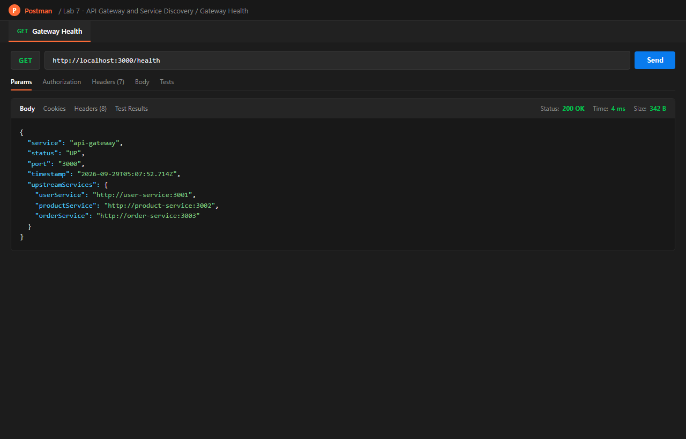
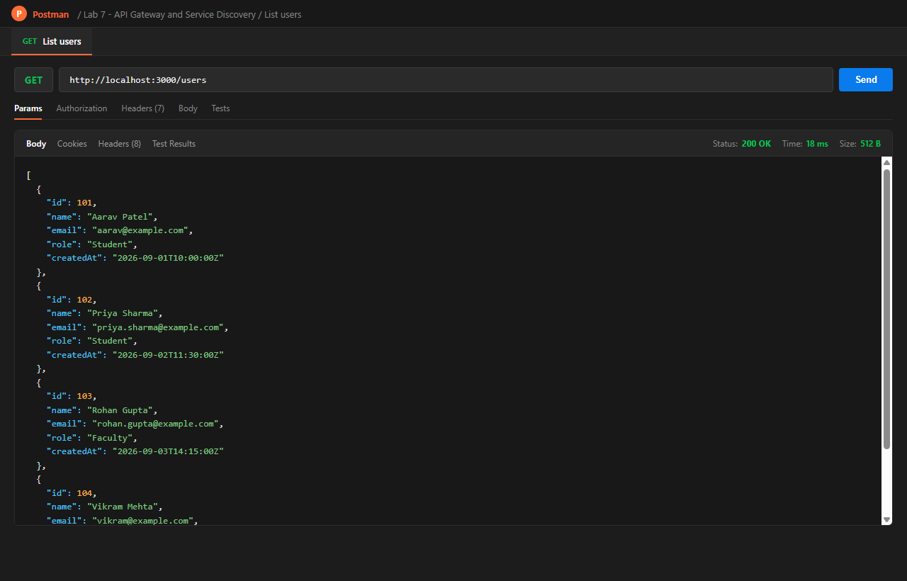
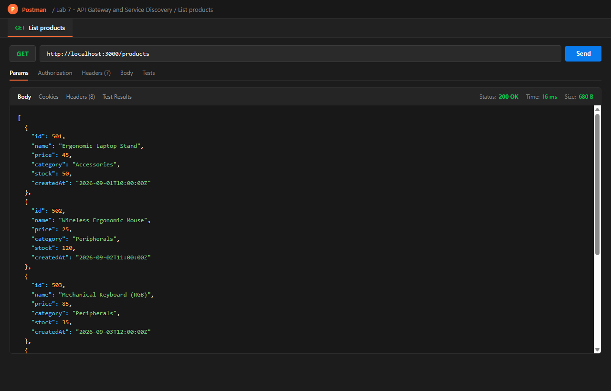
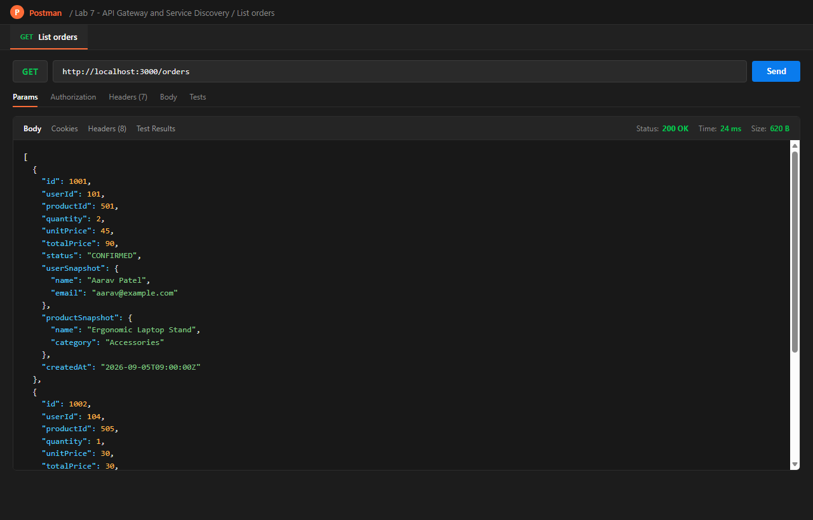
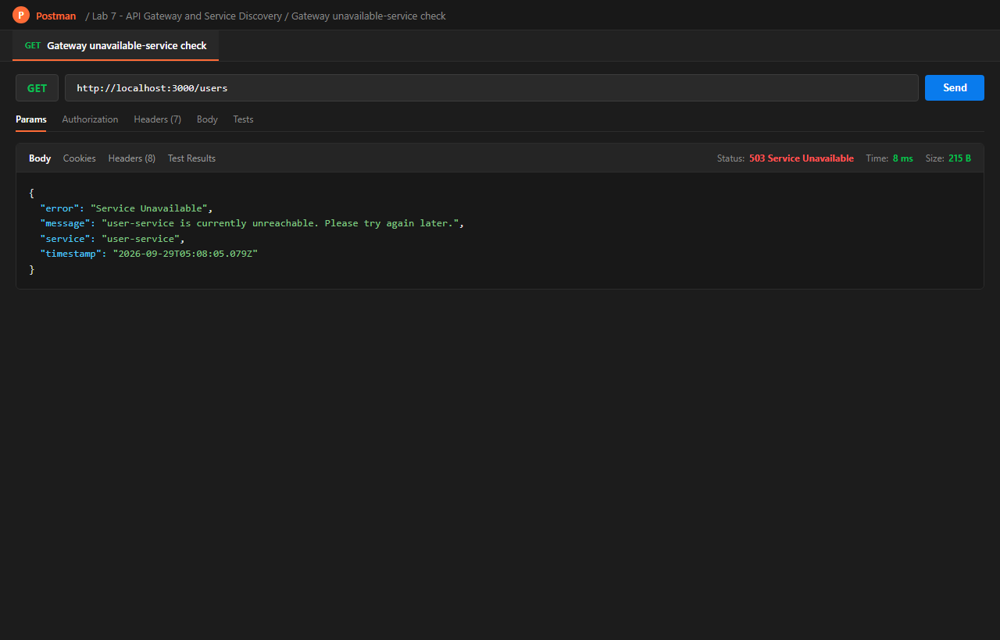

# Lab 7 --- API Gateway, Service Discovery & Cloud Deployment

**Web Services & SOA Laboratory**

This project extends Lab 6 by introducing an **API Gateway**,
configuration-based **service discovery**, and **cloud deployment** for
the existing User, Product, and Order microservices.

The system follows the flow:

**Client / Postman → API Gateway → User / Product / Order Services →
MongoDB Atlas**

The API Gateway acts as the single public entry point, while the
individual microservices remain accessible only inside the Docker
network. The assignment specifies that the existing resource design,
endpoints, and status codes from Lab 6 should remain unchanged.

------------------------------------------------------------------------

## 1. Objectives

The main objectives of this lab are:

-   Build a real API Gateway for the existing microservices.
-   Route `/users`, `/products`, and `/orders` requests to the
    appropriate services.
-   Provide a gateway health-check endpoint.
-   Add request logging at the gateway.
-   Implement centralized `502/503` handling when a service is
    unavailable.
-   Externalize service locations using environment
    variables/configuration.
-   Demonstrate configuration-based service discovery without changing
    application code.
-   Containerize the complete system using Docker Compose.
-   Deploy the application layer to a cloud platform.
-   Test the complete flow using the public gateway URL.

------------------------------------------------------------------------

## 2. Architecture

``` text
                         Internet
                            │
                            ▼
                    ┌───────────────┐
                    │ Client/Postman│
                    └───────┬───────┘
                            │
                            ▼
                    ┌───────────────┐
                    │  API Gateway  │
                    │   /health     │
                    │ /users/*      │
                    │ /products/*   │
                    │ /orders/*     │
                    └───────┬───────┘
                            │
              ┌─────────────┼─────────────┐
              │             │             │
              ▼             ▼             ▼
        ┌──────────┐  ┌──────────┐  ┌──────────┐
        │   User   │  │ Product  │  │  Order   │
        │ Service  │  │ Service  │  │ Service  │
        └────┬─────┘  └────┬─────┘  └────┬─────┘
             │             │             │
             └─────────────┼─────────────┘
                           │
                           ▼
                    ┌─────────────┐
                    │ MongoDB     │
                    │    Atlas    │
                    └─────────────┘

        User / Product / Order services
              remain inside Docker
                  network only
```

### Architecture Responsibilities

  -----------------------------------------------------------------------
  Component               Responsibility          Accessibility
  ----------------------- ----------------------- -----------------------
  Client / Postman        Sends API requests      Internet

  API Gateway             Routing, logging and    Public
                          error handling          

  User Service            User-related business   Docker network
                          logic                   

  Product Service         Product-related         Docker network
                          business logic          

  Order Service           Order-related business  Docker network
                          logic                   

  MongoDB Atlas           Persistent database     Services through
                          storage                 connection string
  -----------------------------------------------------------------------

------------------------------------------------------------------------

## 3. API Gateway

The API Gateway provides a single entry point for clients and forwards
requests to the appropriate microservice.

### Routing

  Gateway Path              Target Service    Example
  ------------------------- ----------------- ------------------------
  `GET /users`              User Service      `GET /users`
  `GET /users/{id}`         User Service      `GET /users/101`
  `POST /users`             User Service      `POST /users`
  `PUT /users/{id}`         User Service      `PUT /users/101`
  `DELETE /users/{id}`      User Service      `DELETE /users/101`
  `GET /products`           Product Service   `GET /products`
  `GET /products/{id}`      Product Service   `GET /products/501`
  `POST /products`          Product Service   `POST /products`
  `PUT /products/{id}`      Product Service   `PUT /products/501`
  `DELETE /products/{id}`   Product Service   `DELETE /products/501`
  `POST /orders`            Order Service     `POST /orders`
  `GET /orders`             Order Service     `GET /orders`
  `GET /orders/{id}`        Order Service     `GET /orders/701`
  `GET /health`             API Gateway       Gateway health check

> The existing Lab 6 resource design, endpoints, and status codes should
> remain unchanged.

------------------------------------------------------------------------

## 4. Why Use an API Gateway?

Without an API Gateway, the client needs to know the address of every
microservice. This exposes the internal service structure and makes the
client responsible for communicating with multiple backend services.

The API Gateway provides a **single entry point** for clients. It hides
the internal service locations and centralizes cross-cutting concerns
such as:

-   Request routing
-   Request logging
-   Error handling
-   Health checks
-   Future authentication/authorization
-   Rate limiting and other gateway-level controls

Therefore, clients communicate with one public address while the gateway
handles communication with the internal microservices.

------------------------------------------------------------------------

## 5. Service Discovery / Configuration

This project uses **configuration-based service discovery**.

The service locations are not hard-coded inside the route-handling
logic. Instead, they are supplied through environment variables.

Example:

``` env
USER_SERVICE_URL=http://user-service:3001
PRODUCT_SERVICE_URL=http://product-service:3002
ORDER_SERVICE_URL=http://order-service:3003
```

The API Gateway reads these values when it starts and uses them to
construct its routing configuration.

### Example Configuration

``` text
USER_SERVICE_URL     → User Service
PRODUCT_SERVICE_URL  → Product Service
ORDER_SERVICE_URL    → Order Service
```

This allows service locations to be changed without modifying the
gateway source code.

### Configuration Change Test

For example, if the User Service changes from:

``` env
USER_SERVICE_URL=http://user-service:3001
```

to:

``` env
USER_SERVICE_URL=http://user-service:3010
```

the gateway configuration can be updated and the application restarted
without changing the routing implementation. In this project, update
`USER_SERVICE_PORT` to `3010` and `USER_SERVICE_URL` to
`http://user-service:3010` in `.env`, then recreate the User Service and
gateway containers with
`docker compose up -d --build --force-recreate user-service api-gateway`.
`GET http://localhost:3000/users` should still return the user list.
Restore both values to port `3001` afterwards. No service or gateway
source code needs to change.

------------------------------------------------------------------------

## 6. Static vs Dynamic Service Discovery

### Configuration-Based / Static Discovery

The approach used in this lab stores service locations in environment
variables or configuration files.

**Advantages:**

-   Simple to implement
-   Easy to understand
-   Suitable for small deployments
-   No additional service-discovery infrastructure required

**Limitation:**

-   Service locations must be updated when services move or change.
-   The gateway does not automatically discover new service instances.

### Dynamic Service Discovery

Systems such as **Consul, Eureka, or Kubernetes DNS/service discovery**
can dynamically maintain information about available service instances.

A dynamic registry can provide:

-   Automatic service registration
-   Service health information
-   Discovery of multiple service instances
-   Support for changing service locations
-   Better handling of scaling and service replacement

Therefore, configuration-based discovery is a lightweight approach,
while dynamic discovery is more suitable for larger and frequently
changing distributed systems.

------------------------------------------------------------------------

## 7. Project Structure

The project structure can be organized as follows:

``` text
project-root/
│
├── api-gateway/
│   ├── src/
│   ├── Dockerfile
│   ├── package.json
│   └── ...
│
├── user-service/
│   ├── src/
│   ├── Dockerfile
│   └── ...
│
├── product-service/
│   ├── src/
│   ├── Dockerfile
│   └── ...
│
├── order-service/
│   ├── src/
│   ├── Dockerfile
│   └── ...
│
├── docker-compose.yml
├── .env
└── README.md
```

> Adjust the structure above to match the actual Lab 6 implementation.

------------------------------------------------------------------------

## 8. Environment Variables

Copy `.env.example` to `.env` and replace the MongoDB URI with your Atlas
application connection string. The User, Product, and Order services
require `MONGODB_URI` at startup. They store records in the `users`,
`products`, and `orders` collections in `MONGODB_DB` (default
`campusconnect`) and initialize the original sample records when those IDs
are absent. Do not commit `.env`.

Example:

``` env
USER_SERVICE_URL=http://user-service:<USER_PORT>
PRODUCT_SERVICE_URL=http://product-service:<PRODUCT_PORT>
ORDER_SERVICE_URL=http://order-service:<ORDER_PORT>

MONGODB_URI=mongodb+srv://<username>:<password>@<cluster-host>/campusconnect?retryWrites=true&w=majority
MONGODB_DB=campusconnect
```

For cloud deployment, configure the same values through the cloud
platform's environment-variable settings instead of hard-coding
cloud-specific values in the source code.

**Do not commit secrets such as MongoDB passwords or private connection
strings to GitHub.**

------------------------------------------------------------------------

## 9. Docker Compose

All services communicate through a Docker network.

Only the API Gateway should expose a port to the outside world.

Conceptually:

``` yaml
services:

  api-gateway:
    build: ./api-gateway
    ports:
      - "<GATEWAY_PORT>:<GATEWAY_PORT>"
    environment:
      - USER_SERVICE_URL=http://user-service:<USER_PORT>
      - PRODUCT_SERVICE_URL=http://product-service:<PRODUCT_PORT>
      - ORDER_SERVICE_URL=http://order-service:<ORDER_PORT>
    depends_on:
      - user-service
      - product-service
      - order-service

  user-service:
    build: ./user-service

  product-service:
    build: ./product-service

  order-service:
    build: ./order-service
```

The exact ports and environment variables should match the existing Lab
6 implementation.

The User, Product, and Order services should **not** expose their ports
externally when accessed through the gateway.

------------------------------------------------------------------------

## 10. Running the Application Locally

### Step 1 --- Clone the Repository

``` bash
git clone <REPOSITORY_URL>
cd <PROJECT_DIRECTORY>
```

### Step 2 --- Configure Environment Variables

Create/update `.env` with the required service URLs and MongoDB Atlas
connection string.

### Step 3 --- Build and Start Containers

``` bash
docker compose up --build
```

### Step 4 --- Check Running Containers

``` bash
docker compose ps
```

### Step 5 --- Test Gateway Health

``` http
GET http://localhost:<GATEWAY_PORT>/health
```

The endpoint should confirm that the API Gateway is running.

------------------------------------------------------------------------

## 11. Testing with Postman

The gateway should be used as the entry point instead of calling the
individual services directly.

Import `postman/Lab7.postman_collection.json` into Postman. Set its
`baseUrl` variable to `http://localhost:3000` for local requests. After
deployment, change `baseUrl` to the public Render gateway URL and rerun the
health and route requests. The final request documents the 502/503 check;
stop the User Service before sending it. Run destructive update/delete
requests only when you are ready to alter the sample records.

### Health Check

``` http
GET http://localhost:<GATEWAY_PORT>/health
```

### User Service Through Gateway

``` http
GET http://localhost:<GATEWAY_PORT>/users
```

``` http
GET http://localhost:<GATEWAY_PORT>/users/101
```

### Product Service Through Gateway

``` http
GET http://localhost:<GATEWAY_PORT>/products
```

``` http
GET http://localhost:<GATEWAY_PORT>/products/501
```

### Order Service Through Gateway

``` http
GET http://localhost:<GATEWAY_PORT>/orders
```

``` http
GET http://localhost:<GATEWAY_PORT>/orders/701
```

POST, PUT, and DELETE requests should use the same resource structure
and status codes defined in Lab 6.

------------------------------------------------------------------------

## 12. Gateway Error Handling

The gateway includes centralized handling for unavailable backend
services.

If a target service cannot be reached, the gateway should return an
appropriate:

-   `502 Bad Gateway`, or
-   `503 Service Unavailable`

instead of hanging or crashing.

### Example Test

1.  Stop one of the backend service containers.
2.  Send a request through the API Gateway to that service.
3.  Confirm that the gateway returns `502` or `503`.
4.  Confirm that the gateway itself continues running.

Example:

``` bash
docker compose stop user-service
```

Then:

``` http
GET http://localhost:<GATEWAY_PORT>/users
```

Expected result:

``` text
502 Bad Gateway
```

or

``` text
503 Service Unavailable
```

------------------------------------------------------------------------

## 13. Request Logging

The API Gateway records basic information for incoming requests.

The log should contain:

``` text
HTTP Method
Request Path
Target Service
Response Status
```

Example:

``` text
GET /users → user-service → 200
GET /products → product-service → 200
GET /orders → order-service → 200
GET /users → user-service → 503
```

This provides centralized visibility into requests passing through the
system.

------------------------------------------------------------------------

## 14. Cloud Deployment

### Cloud Platform: Render

`render.yaml` defines the API Gateway as the only public service and the
three microservices as private services. It wires their internal service
addresses into the gateway and into the Order Service. The gateway
normalizes Render's `host:port` service references to HTTP URLs.

To deploy, push this repository to a Git provider supported by Render,
create a Blueprint from the repository, and deploy the four services.
Render will provide the public gateway URL after the deployment finishes.
The Blueprint is deployment configuration; it does not mean the services
have already been deployed.

### Deployment Components

The cloud deployment consists of:

``` text
Public Internet
      │
      ▼
Public API Gateway
      │
      ├── User Service
      ├── Product Service
      └── Order Service
                │
                ▼
          MongoDB Atlas
```

### Cloud Environment Variables

The Blueprint configures the three service locations. Set `MONGODB_URI`
as a secret environment variable on each microservice in Render. Each
service uses its own collection in `MONGODB_DB`. Atlas must allow network
connections from the deployed services.

``` env
USER_SERVICE_URL=<CLOUD_USER_SERVICE_URL>
PRODUCT_SERVICE_URL=<CLOUD_PRODUCT_SERVICE_URL>
ORDER_SERVICE_URL=<CLOUD_ORDER_SERVICE_URL>
MONGODB_URI=<MONGODB_ATLAS_URI>
MONGODB_DB=campusconnect
```

Do not hard-code these cloud-specific values in the application.

### Public Gateway URL

``` text
<RENDER_PUBLIC_GATEWAY_URL>
```

Example:

``` http
GET <RENDER_PUBLIC_GATEWAY_URL>/health
```

The gateway should be accessible from outside the local machine.

------------------------------------------------------------------------

## 15. Cloud Testing

After deployment, the same Postman tests should be executed against the
public gateway URL.

Examples:

``` http
GET <PUBLIC_GATEWAY_URL>/health
GET <PUBLIC_GATEWAY_URL>/users
GET <PUBLIC_GATEWAY_URL>/products
GET <PUBLIC_GATEWAY_URL>/orders
```

The complete flow should be:

``` text
Postman
   ↓
Public API Gateway
   ↓
Microservices
   ↓
MongoDB Atlas
```

This confirms that the application works over the internet rather than
only on `localhost`.

------------------------------------------------------------------------

## 16. Troubleshooting

### Gateway Cannot Reach a Service

Check:

-   Service container is running.
-   Service URL is correct.
-   Docker service names are correct.
-   All containers are on the same Docker network.
-   The gateway is using the configured environment variables.

Useful command:

``` bash
docker compose ps
```

------------------------------------------------------------------------

### 502/503 Response

A `502` or `503` can indicate that the target service is unavailable or
unreachable.

Check:

``` bash
docker compose logs api-gateway
docker compose logs user-service
docker compose logs product-service
docker compose logs order-service
```

------------------------------------------------------------------------

### MongoDB Connection Failure

Check:

-   MongoDB Atlas connection string.
-   Database credentials.
-   Atlas network-access settings.
-   Cloud environment variables.
-   Whether the connection string has been accidentally committed to
    source control.

------------------------------------------------------------------------

### Gateway Port Already in Use

If the gateway port is already occupied, change the host-side port in
`docker-compose.yml`.

For example:

``` yaml
ports:
  - "8080:<GATEWAY_PORT>"
```

Then access:

``` text
http://localhost:8080
```

------------------------------------------------------------------------

## 17. Deployment Evidence

The following evidence should be included with the submission:

-   Postman requests routed through the gateway.
-   `GET /health` response.
-   User, Product, and Order gateway requests.
-   Unreachable-service `502/503` test.
-   Cloud deployment dashboard or CLI output.
-   Public gateway URL.
-   Postman tests executed against the public gateway URL.
-   Docker Compose configuration.
-   Configuration/environment variables showing service locations are
    externalized.

Add screenshots here if required:

### Gateway Health Check


### Postman Gateway Tests (Users, Products, Orders)




### 502/503 Unavailable Service Error Test


### Cloud Deployment (Render Dashboard)


### Public Gateway Tests (Cloud URL)


------------------------------------------------------------------------

## 18. Learning Outcomes

This lab demonstrates the following concepts:

-   API Gateway as a single entry point
-   Reverse proxy routing
-   Microservice communication
-   Centralized request logging
-   Centralized error handling
-   Configuration-based service discovery
-   Difference between static and dynamic service discovery
-   Docker networking
-   Environment-based configuration
-   Cloud deployment of containerized services
-   Public API access
-   MongoDB Atlas integration

------------------------------------------------------------------------

## 19. Reflection

Compared with Lab 6, the system now uses an API Gateway as the single
entry point for clients instead of exposing the individual microservices
directly. This hides the internal service structure and centralizes
request routing, logging, and error handling. Service locations are
externalized into configuration, allowing them to be changed without
modifying routing code. Docker networking keeps the backend services
internal while the gateway remains publicly accessible. Cloud deployment
also makes the application reachable over the internet instead of only
from localhost. The overall architecture is therefore closer to how a
distributed microservices application can be operated outside a local
development environment.

------------------------------------------------------------------------

## 20. Final Checklist

### API Gateway

-   [x] `api-gateway` service created
-   [x] `/users` routes implemented
-   [x] `/products` routes implemented
-   [x] `/orders` routes implemented
-   [x] `GET /health` implemented
-   [x] Request logging added
-   [x] Centralized `502/503` handling added
-   [x] Only gateway port exposed externally in Compose

### Service Discovery

-   [x] Service URLs stored in environment variables/config
-   [x] No hard-coded service URLs in gateway route-handling code
-   [x] Configuration change tested without code changes
-   [x] Static vs dynamic discovery explained

### Cloud Deployment

-   [x] Cloud platform selected (Render Blueprint prepared)
-   [ ] Gateway deployed
-   [ ] Required microservices deployed
-   [ ] Cloud environment variables configured
-   [ ] MongoDB Atlas connection configured
-   [ ] Public gateway URL available
-   [ ] Public gateway tested using Postman

### Evidence

-   [x] Gateway routing screenshots
-   [x] `/health` screenshot
-   [x] `502/503` test screenshot
-   [ ] Cloud deployment screenshot
-   [ ] Public URL test screenshot
-   [x] Updated README
-   [x] Reflection included

------------------------------------------------------------------------

## 21. Important Note

This lab adds an API Gateway, configuration-based service discovery, and
cloud deployment to the Lab 6 system. The existing **resource design,
endpoints, and status codes should remain unchanged**.
